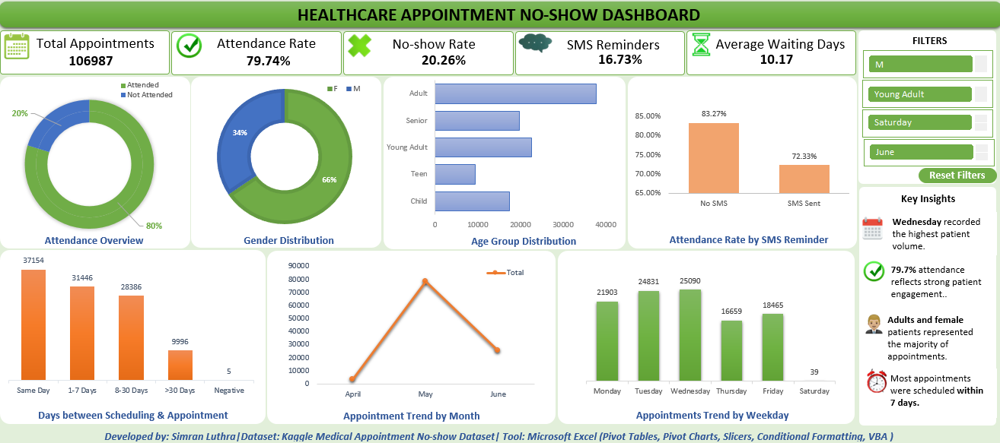

**Healthcare Appointment No-Show Dashboard**

*Project Overview*
This project analyzes over "106,000 healthcare appointment records" to identify patterns associated with patient attendance and no-shows.
The dashboard was developed in Microsoft Excel using Pivot Tables, Pivot Charts, Slicers, Conditional Formatting, and VBA to provide interactive insights into appointment behavior.

*Dashboard Preview*
(

*Key Performance Indicators (KPIs)*
Total Appointments: 106,987
Attendance Rate: 79.74%
No-show Rate: 20.26%
Average Appointment Lead Time: 10.17 days
SMS Reminder Analysis

*Dashboard Features*
 Attendance Overview
 Gender Distribution
 Age Group Distribution
 Appointment Lead Time Distribution
 Appointment Trend by Month
 Appointment Trend by Weekday
 Attendance Rate by SMS Reminder
 Interactive Slicers
 Reset Filters VBA Macro

*Key Insights*
 Overall attendance rate was 79.74%.
 Wednesday recorded the highest appointment volume.
 Adults represented the largest patient group.
 Most appointments were scheduled within same day.
 Patients who received SMS reminders still exhibited a notable no-show rate.

*Tool Used*
Microsoft Excel

*Dataset*
Kaggle Medical Appointment No-show Dataset

*Developed By*
Simran Luthra
Aspiring Healthcare Data Analyst | PharmD Student

*Skills Demonstrated*
Data Cleaning
Excel Formulas
Pivot Tables 
Pivot Charts
Interactive Slicers
KPI Development
Data Visualization
Conditional Formatting
Interactive Reporting
VBA Macro Automation
